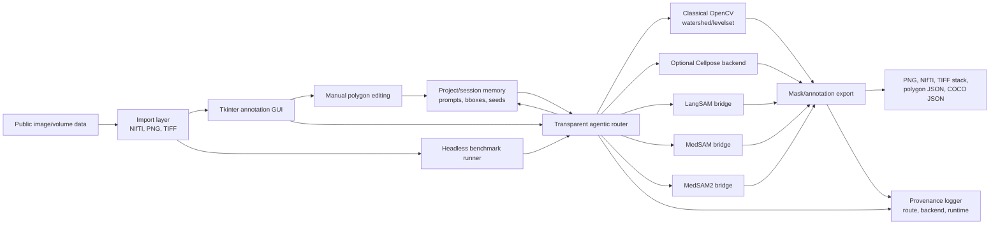

# Figure 1 Architecture Scaffold

Status: scaffold only. Replace with a rendered figure after implementation is stable.

Figure caption draft:

Architecture of the lightweight annotation workflow. Heavy model backends are optional and accessed through external command bridges by default. Provenance and memory store metadata and geometry rather than raw image pixels by default.
