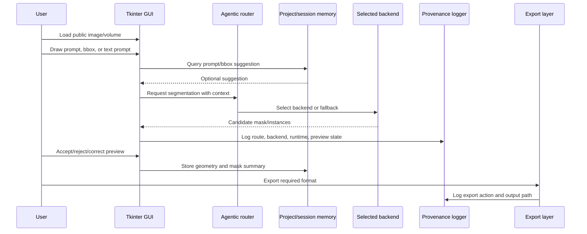

# Figure 2 Workflow Scaffold

Status: scaffold only. Quantitative panels must be generated from actual benchmark outputs.

Figure caption draft:

Annotation workflow for manual and model-assisted segmentation. The router exposes the selected backend and fallback rationale, memory suggests prior geometry without silently overwriting masks, and provenance records the route, runtime, preview decision, and export action.
